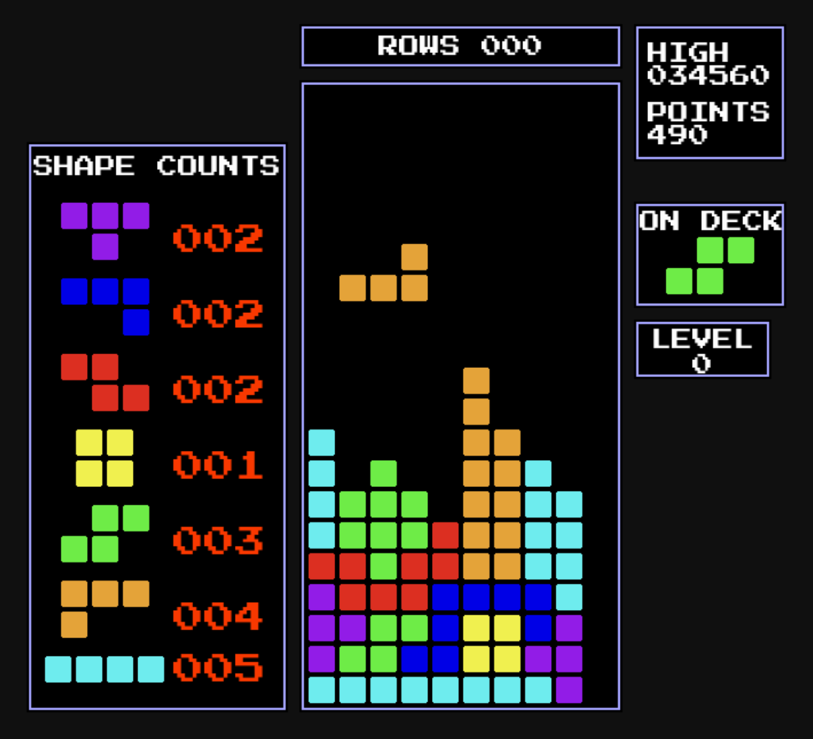

# Geometric Rain

<hr>



<hr>

I haven't made a game since I learned QBasic in school a long time ago, so I decided to make something for fun.

This was inspired by a lot of falling block games.  I plan to add many game modes and pieces when I get time.

<hr>

### How to Play

I'll eventually create a build process, but for now, you have to run it manually:

- clone the repo
  ```bash
  git clone https://github.com/nebko16/geometric_rain.git
  ```
- cd into the root of the repo
  ```bash
  cd geometric_rain
  ```
- install the dependencies
  ```bash
  python -m pip install -r requirements.txt
  ```
- cd into the src directory and save source path to variable
    ```bash
    cd src
    source_root=$(pwd)
    ``` 
- set up python env
    ```bash
    export PYTHONPATH="${PYTHONPATH}:${source_root}"
    ``` 
- run the game
  ```bash
  cd geometric_rain
  python play.py
  ```

#### Control
- `[Escape]` - Pause or Unpause
- `[Left Arrow]`, `[Right Arrow]` - Move the pieces left/right
- `[Up Arrow]` - Rotate the piece clockwise 90 degrees
- `[Down Arrow]` - Drop the piece faster
- `[Q]` - Quit the game
- `[M]` - Toggle the music on/off

<hr>

### Attributions
- Theme
  - [Catch The Mystery by Snabisch](https://makeagame.bandcamp.com)

